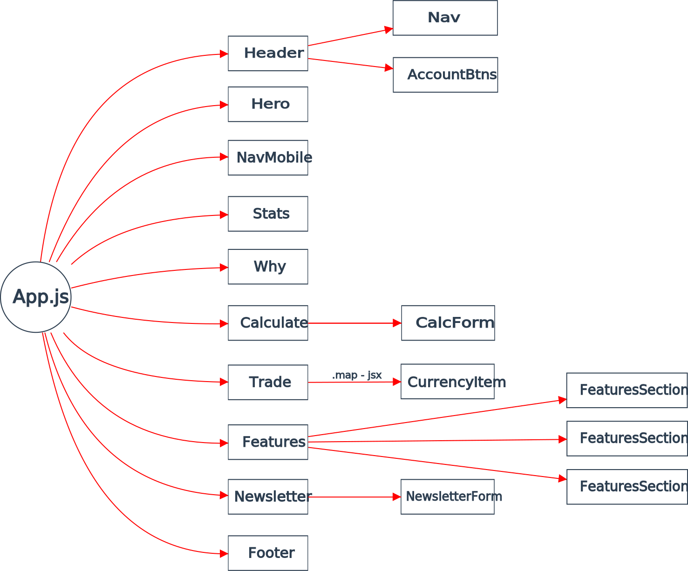

> 7 - Oct - 2022

# Cryptocurrency - Landing Page | [Live Link](https://crypto-lp.netlify.app)

## Yarn base dependencies...

|No| Package Installs           | Use for...                    |
|--|----------------------------|-------------------------------|
| 1| yarn add `aos`             | animation on scrolling        |
| 2| yarn add `react-icons`     | symbolic representation at ui |
| 3| yarn add `-D` `tailwindcss postcss autoprefixer` | CSS Framework |


* Learning context by developing this application:
  * Mobile Nav Menu
  * Responsive design
  * Utilize of Flex System


### AOS initialization in React... (at App.js) 
```
useEffect(() => {
    AOS.init({
      duration: 2500,
      delay: 400,
    })
}, [])
```

```
data-aos='fade-down'
data-aos-delay='900'
data-aos-duration='2000'
```

```
data-aos='fade-up'
data-aos-offset='400'
```

```
data-aos='fade-down'
data-aos-offset='400'
```

```
data-aos='fade-right'
data-aos-offset='300'
```

```
data-aos='fade-left'
data-aos-offset='300'
```

## Project structure

